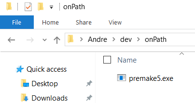
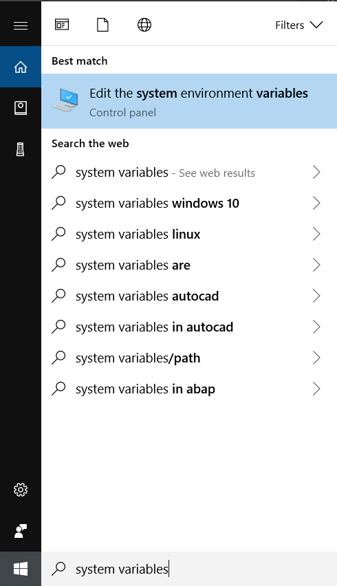
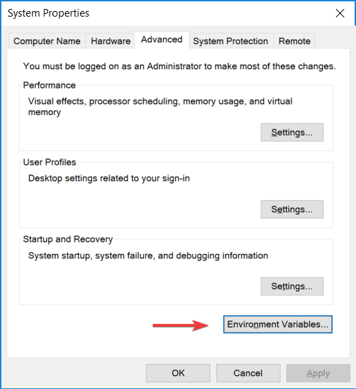

# THIS GUIDE IS INCOMPLETE, UNFINISHED AND A WORK IN PROGRESS. 

It is not suitable for beginners and may be inaccurate.

# How To Set Up OpenGL and GLFW on Windows for C++

By Andre Popovitch

Last updated: 2019/04/16

# What Is OpenGL?

OpenGL is short for Open Graphics Library. This means it provides a set of tools which allow you to display 2D and 3D images to your screen, a process called *rendering*. It is useful because the rendering is typically "hardware accelerated", meaning that the GPU (Graphics Processing Unit) is automatically used to make rendering much faster that it would be otherwise. OpenGL is also useful because it works on a variety of platforms, unlike other graphics libraries such as Metal or Direct3D. OpenGL is considered to be a good starting point for someone new to graphics programming, as there are an immense number of resources available for learners.

# What Is a Build System

A build system is a program that takes some code and some configuration files, and produces a program. Visual Studio includes a build system, which runs automatically when you press the "Local Windows Debugger" button to execute your program. XCode for MacOS also includes something similar, and Make is popular on Linux. An issue occurs when you, a Windows developer, want to share your code to someone using a different platform. The solution is to use a build system like CMake or Premake, which have the ability to work on any platform. **The official build system of the Graphics Programming Discord is Premake**.

# What Is GLFW

Different platforms have different ways of doing things such as creating windows, getting input from the mouse, etc. For simplicity, we use a library called GLFW which provides a single cross-platform interface for many different things you need to do. 

# Prerequisites

This guide assumes you're using Visual Studio. To get help installing Visual Studio, refer to [this guide](/GraphicsProgramming/resources/blob/ogl_for_windows/guides/SettingUpVisualStudio/guide.md).

# Installing Premake5

If you already have Premake you can skip this section.

Go to [Premake's website](https://premake.github.io/download.html) and download the `.zip` folder next to "For Windows".

Once you've downloaded the `.zip`, extract the binary `premake5.exe` and put it on your `PATH` somewhere. My recommendation on how to do this is to navigate to whatever directory you do most of your dev work in and create an `onPath` directory inside of it. Make a note of this directory and add `premake5.exe` to it.

Then type in "system variables" in the Windows search bar and select the option that comes up:

From here this should open the System Properties window. Hit the "Environment Variables" button.

In here, you want to find the entry "Path" under "System Variables". Hit it and then hit "Edit".

This opens every entry on your `PATH`. You `PATH` is every directory where windows will look for a program when you type a command into the command prompt. Double click an empty space and add the directory that you put `premake5.exe` in.

Then, close the window and press "OK" in the System Properties window. The directory has been added to the `PATH` and Premake is installed! To test it, open a new command prompt and type `premake5`. You should see something like this:

