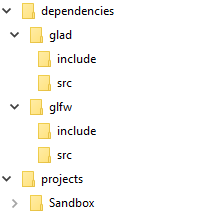

# Premake5 and OpenGL 

By Nick Clark

Last updated: 2019/04/16

## Prerequisites

1. Premake5 is [set up on your development machine](../../../Miscellaneous/Toolchains/Premake/Index.md).
2. A C++ build tool is installed on your development machine such as [Visual Studio](../../../Miscellaneous/Toolchains/Visual_Studio/Index.md).

## Read Before

To learn how to set up Premake 5, read this [guide](../../../Miscellaneous/Toolchains/Premake/Index.md)

## What Is OpenGL?

OpenGL is short for Open Graphics Library. This means it provides a set of tools which allow you to display 2D and 3D images to your screen, a process called *rendering*. It is useful because the rendering is typically "hardware accelerated", meaning that the GPU (Graphics Processing Unit) is automatically used to make rendering much faster that it would be otherwise. OpenGL is also useful because it works on a variety of platforms, unlike other graphics libraries such as Metal or Direct3D. OpenGL is considered to be a good starting point for someone new to graphics programming, as there are an immense number of resources available for learners.


## What Is GLFW

Different platforms have different ways of doing things such as creating windows, getting input from the mouse, etc. For simplicity, we use a library called GLFW which provides a single cross-platform interface for many different things you need to do. 

## Adding OpenGL to Premake5 Projects

In order to add OpenGL to the project, we will use GLFW and GLAD to load OpenGL functions.

You can download the source for each using the following links:

* [GLAD](http://glad.dav1d.de/#profile=core&specification=gl&api=gl%3D4.6&api=gles1%3Dnone&api=gles2%3Dnone&api=glsc2%3Dnone&language=c&loader=on)
* [GLFW](https://github.com/glfw/glfw/releases/tag/3.3)

Once we have this downloaded, we will set up our folder structure as follows:



Next, we can create our Premake configuration.  The configuration file's default name is premake5.lua.  First, we need to add our workspace/solution to the top of the file.  In this, we will create a map for holding each of our include directories for easy access.

```lua
workspace "GettingStartedWithOpenGL"
	startproject "Sandbox"

    configurations {
        "Debug",
        "Release"
    }

    platforms {
        "x86",
        "x64"
    }

    IncludeDir = {}
    IncludeDir["glad"] = "%{sln.location}/dependencies/glad/include"
    IncludeDir["glfw"] = "%{sln.location}/dependencies/glfw/include"
    IncludeDir["qtl"] = "%{sln.location}/dependencies/qtl/include"

    sln = solution();
    outputdir = "%{cfg.buildcfg}/%{cfg.system}/%{cfg.architecture}"
```

Next, we need to set up our projects.  For this tutorial, we will statically link our projects.  Each project configuration is as follows:

### GLFW

```lua
project "glfw"
	kind "StaticLib"
    language "C++"

    targetdir ("%{sln.location}/" .. "bin/" .. outputdir .. "/%{prj.name}")
    objdir ("%{sln.location}/" .. "bin-int/" .. outputdir .. "/%{prj.name}")
    targetname("%{prj.name}")
    
    filter {}
	
	includedirs {
        "include",
    }

    files {
        "src/context.c",
        "src/init.c",
        "src/input.c",
        "src/monitor.c",
        "src/vulkan.c",
        "src/window.c"
    }

	filter "system:windows"
        systemversion "latest"
        toolset "v142"
        cppdialect "C++17"
        staticruntime "Off"

        defines
        {
            "_CRT_SECURE_NO_WARNINGS",
            "_GLFW_WIN32"
        }

        files {
            "src/win32_platform.h",
            "src/win32_joystick.h",
            "src/wgl_context.h",
            "src/egl_context.h",
            "src/win32_init.c",
            "src/win32_joystick.c",
            "src/win32_monitor.c",
            "src/win32_time.c",
            "src/win32_tls.c",
            "src/win32_window.c",
            "src/wgl_context.c",
            "src/egl_context.c"
        }

	filter "system:linux"
		buildoptions "-std=c++17"
		buildoptions "-Wall"
        linkoptions "-pthread"
        buildoptions "-ggdb3"

        defines {
            "_GLFW_X11"
        }

        files {
            "src/x11_platform.h",
            "src/xkb_unicode.h",
            "src/linux_joystick.h",
            "src/posix_time.h",
            "src/posix_tls.h",
            "src/glx_context.h",
            "src/egl_context.h",
            "src/x11_init.c",
            "src/x11_monitor.c",
            "src/x11_window.c",
            "src/xkb_unicode.c",
            "src/linux_joystick.c",
            "src/posix_time.c",
            "src/posix_tls.c",
            "src/glx_context.c",
            "src/egl_context.c"
        }

    filter {}
	
	filter "configurations:Debug"
        runtime "Debug"
        symbols "On"

		defines 
		{ 
			"_DEBUG"
        }
	
	filter "configurations:Release"
		runtime "Release"
        optimize "Speed"

    filter {}
```

### GLAD
```lua
project "glad"
    kind "StaticLib"
    language "C++"

    targetdir ("%{sln.location}/" .. "bin/" .. outputdir .. "/%{prj.name}")
    objdir ("%{sln.location}/" .. "bin-int/" .. outputdir .. "/%{prj.name}")
    targetname("%{prj.name}")

    files {
        "**.h",
        "**.c",
        "**.hpp",
        "**.cpp"
    }

    includedirs {
        "%{IncludeDir.glad}"
    }

    filter "system:windows"
        cppdialect "C++17"
        staticruntime "Off"
        systemversion "latest"
        toolset "v142"

    filter "system:linux"
        buildoptions "-std=c++17"
        staticruntime "Off"

    filter {}

    filter "configurations:Debug"
        runtime "Debug"
        symbols "On"

    filter "configurations:Release"
        runtime "Release"
        symbols "Off"
        optimize "Full"
    
    filter {}
```

Finally, we need to create our project configuration for our sandbox project.  To do that, we must include the headers for GLFW and GLAD, as well as link against those projects.  The following premake snippet does just that.

```lua
project "sandbox"
    kind "ConsoleApp"
    language "C++"

    targetdir ("%{sln.location}/bin/" .. outputdir .. "/%{prj.name}")
    objdir ("%{sln.location}/bin-int/" .. outputdir .. "/%{prj.name}")

    files {
        "**.h",
        "**.c",
        "**.hpp",
        "**.cpp"
    }

    includedirs {
        "%{IncludeDir.glad}",
        "%{IncludeDir.glfw}",
        "%{IncludeDir.sandbox}"
    }

    dependson {
        "glad",
        "glfw"
    }

    libdirs {
        "%{sln.location}/bin/" .. outputdir .. "/glad",
        "%{sln.location}/bin/" .. outputdir .. "/glfw"

    }

    links {
        "glad",
        "glfw"
    }

    filter "system:windows"
        cppdialect "C++17"
        staticruntime "Off"
        systemversion "latest"
        toolset "v142"

    filter "system:linux"
        buildoptions "-std=c++17"
        staticruntime "Off"

    filter {}

    filter "configurations:Debug"
        runtime "Debug"
        symbols "On"

    filter "configurations:Release"
        runtime "Release"
        symbols "Off"
        optimize "Full"
    
    filter {}
```

The final Premake configuration file can be found [here](resources/premake5.lua).

Finally, we run the premake file using the premake command as follows:

* Windows: premake5 vs2017
* Linux: premake5 gmake
