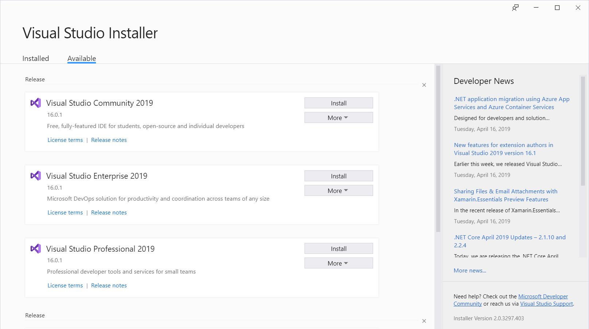
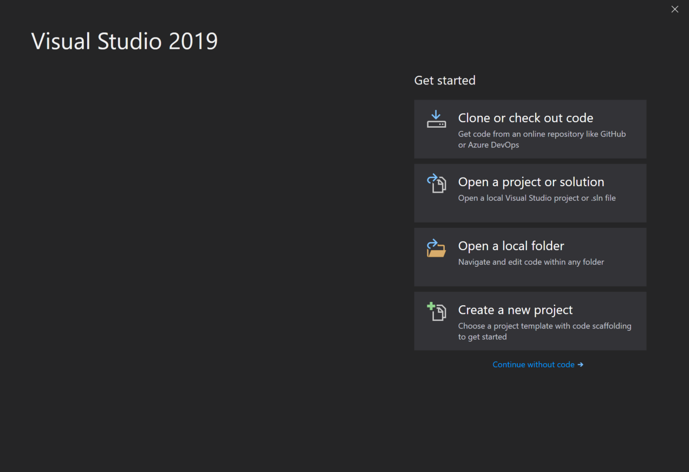
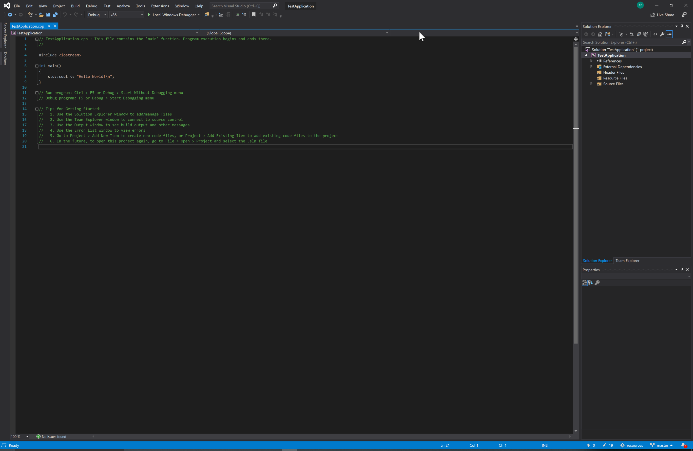

# How To Set Up a C++ Environment with Visual Studio on Windows

By Andre Popovitch

Last updated: 2019/04/16

## What is Visual Studio?

Visual Studio is an environment for writing C++, and C# applications (among others). Made by Microsoft, it is only available on Windows.

## Prerequisites

None

## How to setup a C++ Environment

The program you'll most likely be using for writing C++ programs on Windows is [Visual Studio Community Edition](https://visualstudio.microsoft.com/vs/community/), made by Microsoft. You should be able to download a program titled `vs_community.exe`. Run this, and the Visual Studio installer should begin.

Press continue. Soon you should see this:

Select "Visual Studio Community". Then, you should see these options:

Select "Desktop development with C++" and anything else that seems interesting to you, then press "Install". If you see this, that means you've done it right:
 

This will probably take some time, so go grab a coffee. Once it's installed, the sign-in window should pop up.

You don't have to sign in but if you have a Microsoft account it does actually come in handy. After that, congratulations, you've now installed Visual Studio!

## Making a Test Project

If VS (Visual Studio) automatically launched, excellent. If it did not, you can launch it by searching in the Windows search bar.

Now, you should see the start page on Visual Studio, although yours may not look exactly the same as mine. Select "Create a new project" in the bottom right.

Visual Studio provides some starting templates for you to choose from. The one we're interested in is "Console App". Select it then press "Next".

We have to chose the name of our application and where to save it. I've named mine "TestApplication" but there's no reason you have to name yours the same way.

Then, press "Create". Finally, we can edit some code!

At the top of the window, press "Local Windows Debugger". This is how you run your program. A window should pop up that says "Hello World!"

Congratulations! You now have Visual Studio up and running. 

You've created a Visual Studio Project, but that lives inside a Visual Studio Solution (which contains all the information about your projects that Visual Studio needs to build your program). To reopen your project, simply find wherever you saved the solution and open it.

## Where To Go from Here

Consider setting up OpenGL for Windows, which will allow you to make programs that render images to the screen, instead of just text. Tutorial for that coming soon :)

## Questions

The best place to ask for help is at the [Graphics Programming Discord Server](https://discord.gg/Eb7P3wH). Be sure to be polite and state your problem clearly - screenshots are always appreciated!